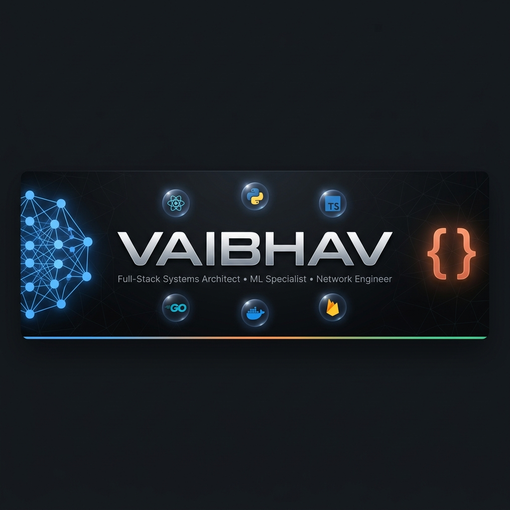

 

 

---

## 🚀 About Me

I am a product-focused **Software Engineer** specializing in highly scalable web architectures and enterprise-grade network topologies. I turn complex system constraints into clean, high-performance, and beautifully modular software solutions.

> [!IMPORTANT]
> **My Engineering Philosophy:** *Data models before user interfaces. Symmetrical topologies over arbitrary layouts. Clean, predictable, and mathematical correctness always triumphs over temporary patches.*

---

## 🔥 Featured Project

 

**⚙️ EF-Core — Enterprise Framework Core** 
*The Operating System for Advanced Workflow Automation*

`67 Workflows` · `271 Modules` · `92 Commands` · `7 Integrations` · `2,836 Tests`

Works natively across **Modern Code Editors** · **VS Code** · **Data Analytics Engines** · **Enterprise Workspaces**

---

## 🏆 Signature Projects

<table width="100%">
  <tr>
    <td width="50%" valign="top">
      <h3>🏫 KLE Connect</h3>
      
<b>Enterprise Campus Portal:</b> A highly-scalable community communication and collaborative academic resource-sharing web application.

      

        <a href="https://github.com/VAIBHAV7848/KLE_CONNECT"><b>Codebase ➔</b></a> |
        <a href="https://kle-connect.vercel.app"><b>Live App ➔</b></a>
      

      <code>TypeScript</code> <code>React</code> <code>Next.js</code> <code>Firebase</code>
    </td>
    <td width="50%" valign="top">
      <h3>💳 ExpenseIQ</h3>
      
<b>Fintech Budget Dashboard:</b> Sleek, premium personal finance tracker with glassmorphic analytics, budget widgets, and automated offline data sync.

      

        <a href="https://github.com/VAIBHAV7848/ExpenseIQ"><b>Codebase ➔</b></a> |
        <a href="https://expense-iq-gold.vercel.app"><b>Live App ➔</b></a>
      

      <code>JavaScript</code> <code>PWA</code> <code>Vite</code> <code>Service-Worker</code>
    </td>
  </tr>
  <tr>
    <td width="50%" valign="top">
      <h3>🌲 Wildfire Survival Analysis</h3>
      
<b>WiDS Datathon 2026:</b> High-integrity predictive data modeling and survival analysis for the global datathon competition.

      

        <a href="https://github.com/VAIBHAV7848/WiDS-Global-Datathon-2026---Wildfire-Survival-Analysis"><b>Codebase ➔</b></a>
      

      <code>Python</code> <code>Data Science</code> <code>Predictive Modeling</code>
    </td>
    <td width="50%" valign="top">
      <h3>🏛️ JNMC Campus Network</h3>
      
<b>Enterprise Network Topology:</b> Mathematically centered GNS3 enterprise network model with custom positioning algorithms.

      

        <a href="https://github.com/VAIBHAV7848/jnmc-belgaum-campus-network"><b>Codebase ➔</b></a>
      

      <code>GNS3</code> <code>Python Automation</code> <code>Cisco IOS</code>
    </td>
  </tr>
</table>

---

## 🛠️ Tech Stack

---

## 📈 GitHub Analytics

---

  

